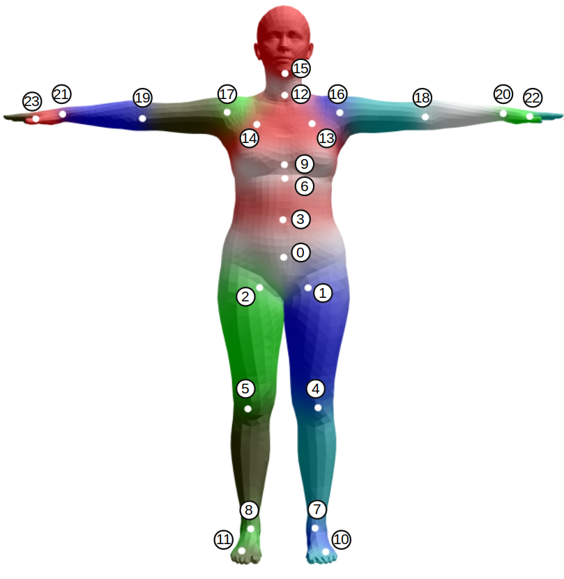

# Keypoints Definition
{: .no_toc }

1. TOC
{:toc}
---

## Keypoints definition
### OpenPose

We mainly use the keypoints defined by OpenPose[^openpose], including body, hand and face.

|name||
|----|----|
|body| |
|hand|  |
|face|  |

### SMPL

SMPL[^smpl] model is used for parametric human body model. We use the 24 body keypoints defined by SMPL.

|name||
|----|----|
|SMPL| |

## Conversion

During the fitting process, we use a `J_regressor` to convert SMPL vertices to OpenPose keypoints. The `J_regressor` is defined as a matrix $$J\in\mathbb{R}^{25\times 6890}$$.

[^smpl]: Loper, Matthew, et al. "SMPL: A skinned multi-person linear model." ACM transactions on graphics (TOG) 34.6 (2015): 1-16.

[^openpose]: Cao, Z., Hidalgo, G., Simon, T., Wei, S.E., Sheikh, Y.: Openpose: real-time multi-person 2d pose estimation using part affinity fields. arXiv preprint arXiv:1812.08008 (2018)

[^hrnet]: Sun, Ke, et al. "Deep high-resolution representation learning for human pose estimation." Proceedings of the IEEE/CVF Conference on Computer Vision and Pattern Recognition. 2019.

[^mediapipe]: Lugaresi, Camillo, et al. "Mediapipe: A framework for building perception pipelines." arXiv preprint arXiv:1906.08172 (2019).

[^yolov4]: Bochkovskiy, Alexey, Chien-Yao Wang, and Hong-Yuan Mark Liao. "Yolov4: Optimal speed and accuracy of object detection." arXiv preprint arXiv:2004.10934 (2020).