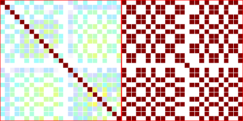

{: .no_toc }

1. TOC
{:toc}
---


## Try the code

Next, we will discuss one of the challenging problems in the field of human motion capture: recovering multiple people's poses from multi-view videos. This problem involves a wide range of variations in camera setups, scene sizes, the number of people in the scene, and the distribution of their motion speeds. Therefore, it is necessary to use different configurations for different types of data.

We will use the scenario settings of ZJUMoCap as an example to illustrate our algorithmic process.The example dataset can be download from [04_multiperson/ballet_2person.zip](http://gofile.me/66p77/5bnFUgpmq). After downloading, unzip it to the `data/examples` folder.

Install the matching extension first:

```bash
cd library/pymatch
python3 setup.py develop
```
    
Then, run the following command:

```bash
data=data/examples/ballet_2person
emc --cfg config/mvmp/body/ballet_2person.yml --root ${data}
```

<div align="center">
    <video width="80%" playsinline="" autoplay="autoplay" loop="loop" preload="" muted=""><source src="./assets/04_ballet.mp4" type="video/mp4">
    </video>
    <br>
    <sup>The skeletons and fitted SMPL results.</sup>
</div>

## Basic Idea

- **Matching**: We employ low-rank matrix optimization to establish correspondences between individuals in multi-view.
- **Optimization**: We fit the SMPL model to each person individually to obtain their respective poses.

## Step-by-step Explanation

The config file is `config/mvmp/body/ballet_2person.yml`. This file use two base config:

```yaml
data: config/datasets/mvimage.yml
exp: config/mvmp/detect_match_triangulate_fitSMPL.yml
data_opts:
    ... # set the options for this dataset
exp_opts:
    ... # set the options for this experiment
```

### dataset

Using the `config/datasets/mvimage.yml` configuration file, we follow the same approach as in the previous single-person multi-view case. 

### at_step

##### Detect

In multi-person scenarios, we utilize **YOLO** and **HRNet** or **ViTPose** for human keypoint detection, similar to the single-person case. However, we apply additional filtering to remove excessively large or small bounding boxes. This filtering step helps improve the accuracy of detected keypoints by eliminating outliers that do not correspond to valid human poses.

```yaml
    detect:
      module: myeasymocap.backbone.yolo.yolo.MultiPerson # Use YOLO to detect multi-person
      key_from_data: [images, imgnames]
      args:
        model: yolov5m
        name: person
        min_length: 150 # this two threshold control the wanted bboxes
        max_length: 1000
    keypoints2d:
      module: myeasymocap.backbone.hrnet.myhrnet.MyHRNet
      key_from_data: [images, imgnames]
      key_from_previous: [bbox]
      key_keep: []
      args:
        ckpt: data/models/pose_hrnet_w48_384x288.pth
        single_person: False # This flag controls the function to detect all keypoints
```

#### Match

This section utilizes the defined class `myeasymocap.operations.match_base.MatchAndTrack`, which primarily consists of two modules:

```python
class MatchAndTrack():
    def __init__(self, cfg_match, cfg_track) -> None:
        self.matcher = MatchBase(cfg_match)
        self.tracker = TrackBase(cfg_track)
```

The `matcher module` is responsible for matching multiple individuals in a multi-view setting, while the `tracker module` handles tracking individuals across multiple frames.

The main parameters of the matcher module include:

- `distance`: A module used to calculate the similarity between two individuals.
  - `mode`: By default, it uses the `epipolar` mode, which employs epipolar geometry to calculate the distance between two individuals in different views.
  - `threshold`: The epipolar distance is normalized by the camera focal length. This parameter controls the inlier threshold for matching.
  - `threshold_track`: Inlier threshold for matching during tracking.
  - `min_common_joints`: Controls the minimum number of common keypoints required for a valid pair.
  - `cfg_svt`: Parameters used to control the SVT (Singular Value Thresholding) optimization.
- `triangulate`:
  - `min_view`: The minimum number of views required for triangulation.
  - `dist_max`: The maximum allowable reprojection error during triangulation.
  - `dist_track`: The maximum distance in mm between the current frame and the previous frame.

These parameters play a crucial role in determining the quality of matching and triangulation results. For detailed configuration options, please refer to the corresponding configuration file.

<div align="center">
    
    <br>
    <sup>SVT: The matrix on the left represents the affinity matrix computed through the distance module. The matrix on the right represents the low-rank matrix obtained after optimization using SVT.</sup>
</div>

The tracker module is responsible for maintaining records of all individuals in the scene, including adding and removing individuals, as well as filtering out individuals outside the desired scene.

The `cfg_track` parameter controls the parameters of the tracker module, including:

- `max_missing`: Specifies the maximum number of consecutive frames an individual can be missing before being considered lost.
- `final_ranges`: Defines the desired valid spatial range for the final output.

For the complete configuration of this module, please refer to the corresponding configuration file.

### at_final

We fit the SMPL model to 3D keypoints for each person. The main step is as follow:

```yaml
    collect: # split the results of each frame to each person
    load_body_model: # Load the SMPL model
    fitting_each_person:
      module: myeasymocap.stages.basestage.StageForFittingEach
      key_from_previous: [model, results]
      key_from_data: []
      args:
        stages: _file_/config/mvmp/meta_fit_SMPL.yml
        # load the multistage configuration file
        keys_keep: [params]
    write: ...
    vis_render: ... # render the SMPL results
```

## More Examples

The data can be downloaded from `04_multiperson/{name}.zip` at [url](http://gofile.me/66p77/5bnFUgpmq), and the config can be found in `config/mvmp/body/{name}.yml`.

|Name|Preview|
|:----|----|
|boxing|<video width="100%" playsinline="" autoplay="autoplay" loop="loop" preload="" muted=""><source src="./assets/04_boxing.mp4" type="video/mp4"></video><br>|
|soccer1_6|<video width="100%" playsinline="" autoplay="autoplay" loop="loop" preload="" muted=""><source src="./assets/04_soccer1.mp4" type="video/mp4"></video><br>|


## Multi-object

TODO
<!-- 使用同样的方法可以对多个物体进行重建 -->