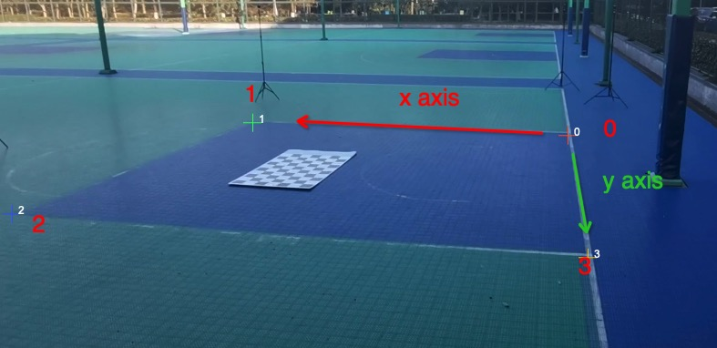

# Detect the chessboard

## ChArco

```bash
python3 apps/calibration/detect_charuco.py ${root}/ba --mode sparse --squareLength 0.1 --aruco_len 0.0714
python3 apps/annotation/annot_calib.py ${root}/ba --annot chessboard --mode chessboard --pattern 5,3
```

|||
|----|----|
|--mode||
|--squareLength| the length of the square (unit meter)|


## Mannual

```bash
python3 apps/calibration/create_marker.py ${root}/background1f --N 4 --N_group 4
python3 apps/annotation/annot_mv_points.py ${root}/background1f
```

## Example

### 1. Basketball Court

Download the Web Annotation Tool.

```bash
git clone https://github.com/chingswy/EasyAnnot.git
```

Start the server, open the server in the browser: `http://0.0.0.0:2345/match_points`

```bash
python3 app.py --root ${data}/ground1f --port 2345
```

Annotate the points and export.



You should measure the length of (0, 1) and (0, 3). It's 5.8meter and 4.9meter ideally.

## Format

Image `000000.jpg` has its annotation file `0000000.json`:
```bash
{
    'keypoints3d': [[x0, y0, z0], [x1, y1, z1], ..., ],
    'keypoints2d': [[u0, v0, c0], [u1, v1, c1], ..., ].
}
```
