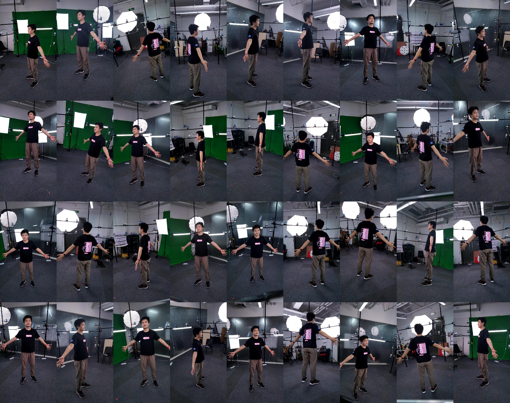

# Studio + multiple dense

- **When use this:** dense cameras, simply calibrate by colmap;

### Capture

<div align="center">
    
    <br>
    <sup>background</sup>
    <br>
    
    <br>
    <sup>ground</sup>
    <br>
    
    <br>
    <sup>human</sup>
</div>

Place the data as follows. You can use script to copy the data from raw data:

```bash
python3 scripts/preprocess/copy_dataset.py <path/to/rawdata> ${root}/ground1f --start 0 --end 1
```

After this:

```bash
<root>
├── background1f
│   └── images
├── human1f
│   └── images
└── ground1f
    └── images
```

### Calibrate

Always, we calibrate the camera with `human1f` which can provide more feature points in the surface. Alternatively, you can use `background1f` or `ground1f`.

```bash
python3 apps/calibration/calib_dense_by_colmap.py ${root}/human1f ${root}/colmap-human1f --share_camera --colmap ${colmap}
```

Visualize the results with colmap.

```bash
$colmap gui --database_path ${root}/colmap-human1f/database.db --image_path ${root}/colmap-human1f/images --import_path ${root}/colmap-human1f/sparse/0
```

Detect the chessboard:

```bash
python3 apps/calibration/detect_chessboard.py ${root}/ground1f --out ${root}/ground1f/output --pattern 11,8 --grid 0.06
```

{: .note }
If the chessboard is so small that can not be detected automaticly. You should manually annotate it.

```bash
python3 apps/calibration/create_marker.py ${root}/ground1f --grid 0.6 0.42 --corner --overwrite
python3 apps/annotation/annot_calib.py ${root}/ground1f --annot chessboard --mode chessboard --pattern 2,2
```

{: .note }
If you use ChAruco, following this:

```bash
python3 apps/calibration/detect_charuco.py ${root}/ground1f --mode sparse --show
```

Align the camera parameters:

```bash
python3 apps/calibration/align_colmap_ground.py ${root}/colmap-human1f/sparse/0 ${root}/colmap-align --plane_by_chessboard ${root}/ground1f
```

Check the camera parameters:

```bash
python3 apps/calibration/check_calib.py ${root}/ground1f --mode cube --out ${root}/colmap-align --show
python3 apps/calibration/check_calib.py ${root}/ground1f --mode match --out ${root}/colmap-align --show --annot chessboard
```

### Check with Instant-ngp

Currently, ngp only supports cameras with the same camera intrinsics.

```bash
# convert the data
python3 apps/calibration/easymocap2nerf.py ${root}/human1f --out ${root}/ngp-human1f --aabb_scale 4 --frame 0
# train and visualize ngp
cd 3rdparty/instant-ngp
data=${root}/human1f
# interactively
./build/testbed --scene ${root}/ngp-human1f
# or run in background
python3 scripts/run.py --scene ${data} --mode nerf --screenshot_transforms ${data}/transforms_novel.json --n_steps 100000 --width 1080 --height 1920 --screenshot_dir ${data}/output --save_snapshot ${data}/ckpt.msgpack
```


