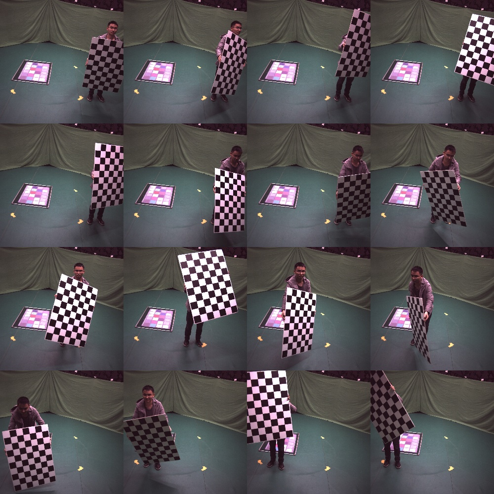
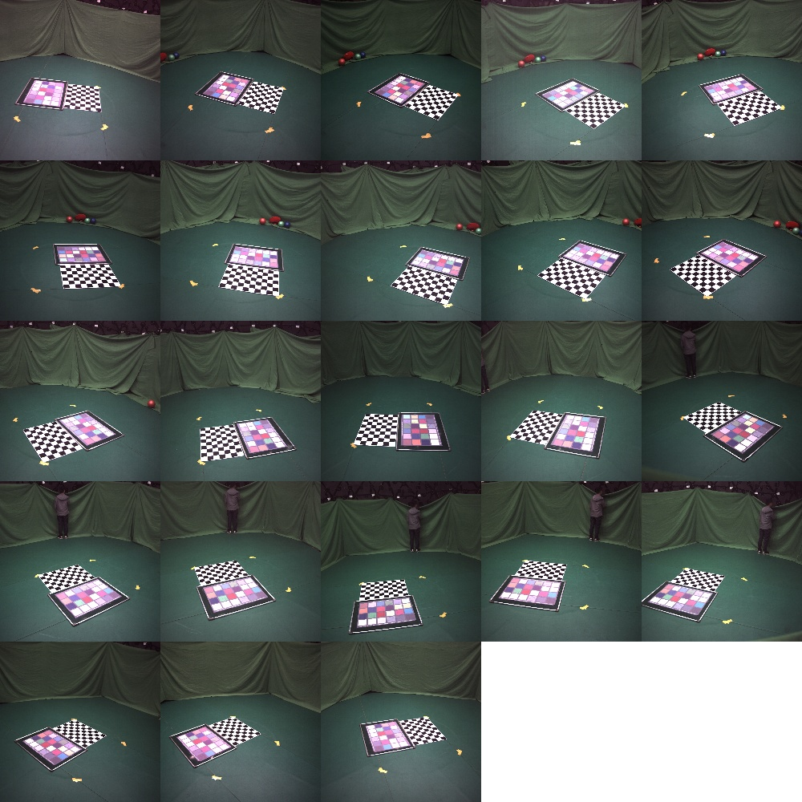
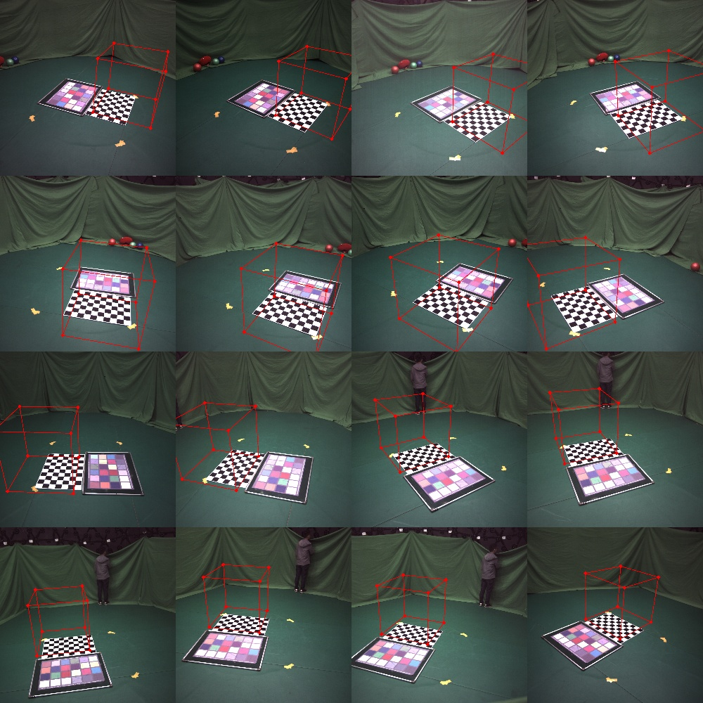
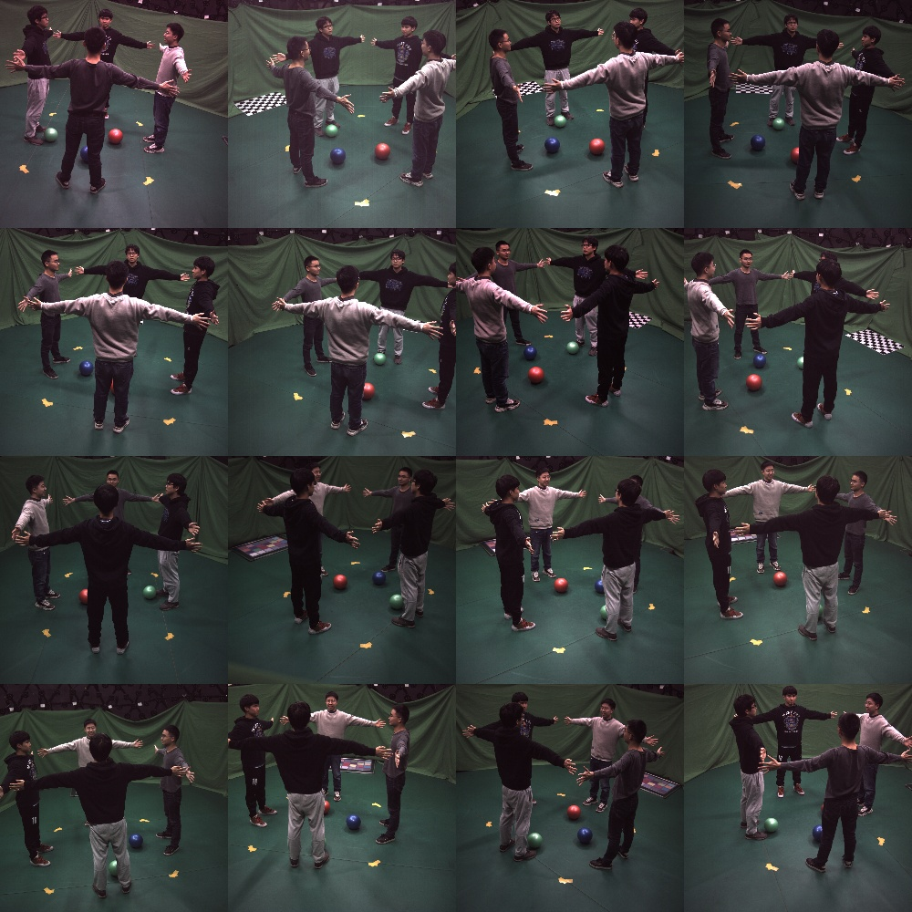

# Studio + multiple sparse

- **When use this:** sparse cameras, hard to initialize for colmap;
- **Idea:** Chessboard for initialization. Merge feature points from different frames and BA together.
- Here you can find the [example data](https://zjueducn-my.sharepoint.com/:u:/g/personal/s_q_zju_edu_cn/EWsM-G3mEi5Gt-Xs7a7bJqIBqd_1FK__9_HmFCvvBGrPTg?e=IsZG9h).

## Initialization

```bash
├── ground1f
│   └── images
└── intri
    └── images
```

## Capture 

<div align="center">
    
    <br>
    <sup>intri</sup>
    <br>
    
    <br>
    <sup>ground</sup>
</div>

## Run

```bash
# detect the chessboard
python3 apps/calibration/detect_chessboard.py ${root}/intri --out ${root}/intri/output --pattern 9,6 --grid 0.1
# detect the chessboard
python3 apps/calibration/detect_chessboard.py ${root}/ground1f --out ${root}/ground1f/output --pattern 9,6 --grid 0.1 --check
```

```bash
# Run this if auto-detect failed
python3 apps/annotation/annot_calib.py ${root}/ground1f --mode chessboard --annot chessboard
```


Calibrate:

```bash
# calibrate the intrinsic
python3 apps/calibration/calib_intri.py ${root}/intri
# calibrate the extrinsic
python3 apps/calibration/calib_extri.py ${root}/ground1f --intri ${root}/intri/output/intri.yml
```

Check the calibration

```bash
python3 apps/calibration/check_calib.py ${root}/ground1f --out ${root}/ground1f --mode cube --write
```

Check `${root}/ground1f/cube`, or run with flag `--show` to visualize.

<div align="center">
    
    <br>
    <sup>cube</sup>
</div>


{: .note }
Previous step is enough for camera calibration. The next step is for the advanced developers.


Capture a static scene with multiple person and calibrate them with colmap.

<div align="center">
    
    <br>
    <sup>cube</sup>
</div>


```bash
python3 apps/calibration/calib_sparse_by_colmap.py ${root}/human519 --init ${root}/ground1f --out /mnt/data2/shuai/calib-zjumocap --colmap ${colmap}
```
