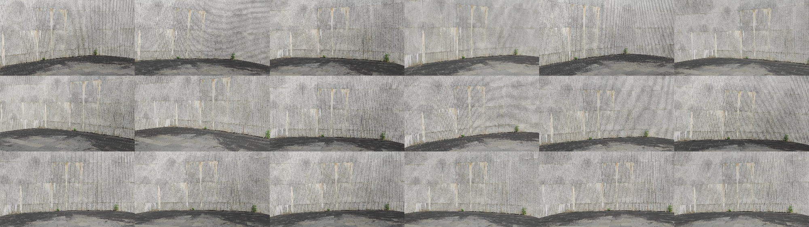
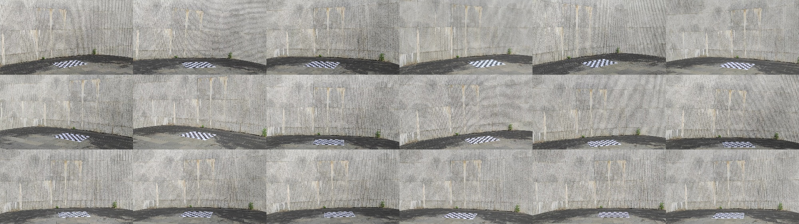

# Wild + multiple sparse

- **When use this:** sparse cameras, hard to calibrate for colmap;
- **Idea:** Use an extra phone to record the scene.
- Here you can find the [example data]().

## Capture 

<div align="center">
    
    <br>
    <sup>background</sup>
    <br>
    
    <br>
    <sup>ground</sup>
    <br>
    <video width="90%" playsinline="" autoplay="autoplay" loop="loop" preload="" muted=""><source src="assets/wild-sparse-scan.mp4" type="video/mp4">
    </video>
    <br>
    <sup>scan</sup>
</div>


```bash
python3 apps/calibration/calib_static_dynamic_by_colmap.py ${root}/background1f ${root}/colmap --colmap ${colmap} --step 4
# check with colmap
${colmap} gui --database_path ${root}/colmap/database.db --image_path ${root}/colmap/images --import_path ${root}/colmap/sparse/0
```