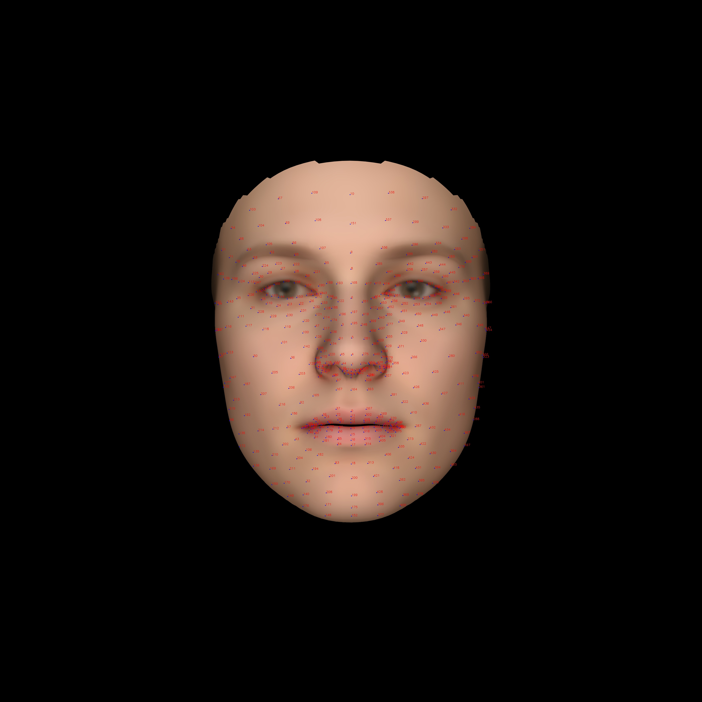

# Keypoints Definition
{: .no_toc }

1. TOC
{:toc}
---

## Extract keypoints

In most common usage, we use `body25 format` of OpenPose[^openpose] as our standard keypoints. Outputs of other method like `HRNet`[^hrnet], `mediapipe`[^mediapipe] will be converted to `body25 format`.

### YOLOv4+HRNet

Download the model from their official websites: [HRNet](https://drive.google.com/drive/folders/1hOTihvbyIxsm5ygDpbUuJ7O_tzv4oXjC)

```bash
data/models
├── pose_hrnet_w48_384x288.pth
└── yolov4.weights
```

No other requirements are needed, just run:

```bash
python3 apps/preprocess/extract_keypoints.py ${data} --mode yolo-hrnet
```

### OpenPose

OpenPose[^openpose] can detect the human body, hand, facial and foot keypoints, you should install this follow their [tutorial](https://github.com/CMU-Perceptual-Computing-Lab/openpose).


```bash
openpose=<path/to/openpose/installation>
# detect the body and feet keypoints
python3 apps/preprocess/extract_keypoints.py ${data} --mode openpose --openpose ${openpose}
# detect the hand and face if needed
python3 apps/preprocess/extract_keypoints.py ${data} --mode openpose --openpose ${openpose} --hand --face
```

### Mediapipe

Install it with pip:

```
python3 -m pip install mediapipe
```

Run the detection of full body:

```bash
python3 apps/preprocess/extract_keypoints.py ${data} --mode mp-holistic
```

### YOLOv4+Openpose

This mode will first perform human detection[^yolov4] and second run the OpenPose on the cropped images.

```bash
python3 apps/preprocess/extract_keypoints.py ${data} --mode openposecrop --openpose ${openpose}
```

### YOLOv4+HRNet+Openpose

This mode will first perform human detection and second run the HRNet on the cropped images. Finnally use OpenPose to detect the feet keypoints.

```bash
python3 apps/preprocess/extract_keypoints.py ${data} --mode yolo-hrnet & python3 apps/preprocess/extract_keypoints.py ${data} --mode feetcrop --openpose ${openpose} --force
```

## Keypoints definition
### OpenPose

|name||
|----|----|
|body| |
|hand|  |
|face|  |

### Mediapipe

|name||
|----|----|
|body| |
|hand|  | 
|face|  |

### SMPL

|name||
|----|----|
|SMPL[^smpl]| |


[^smpl]: Loper, Matthew, et al. "SMPL: A skinned multi-person linear model." ACM transactions on graphics (TOG) 34.6 (2015): 1-16.


[^openpose]: Cao, Z., Hidalgo, G., Simon, T., Wei, S.E., Sheikh, Y.: Openpose: real-time multi-person 2d pose estimation using part affinity fields. arXiv preprint arXiv:1812.08008 (2018)

[^hrnet]: Sun, Ke, et al. "Deep high-resolution representation learning for human pose estimation." Proceedings of the IEEE/CVF Conference on Computer Vision and Pattern Recognition. 2019.

[^mediapipe]: Lugaresi, Camillo, et al. "Mediapipe: A framework for building perception pipelines." arXiv preprint arXiv:1906.08172 (2019).

[^yolov4]: Bochkovskiy, Alexey, Chien-Yao Wang, and Hong-Yuan Mark Liao. "Yolov4: Optimal speed and accuracy of object detection." arXiv preprint arXiv:2004.10934 (2020).