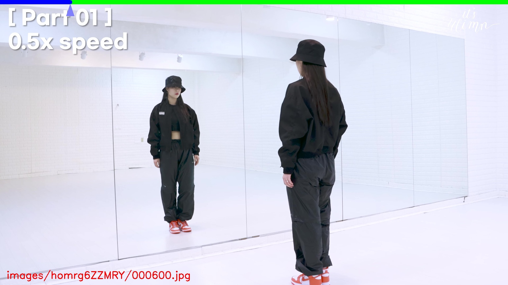
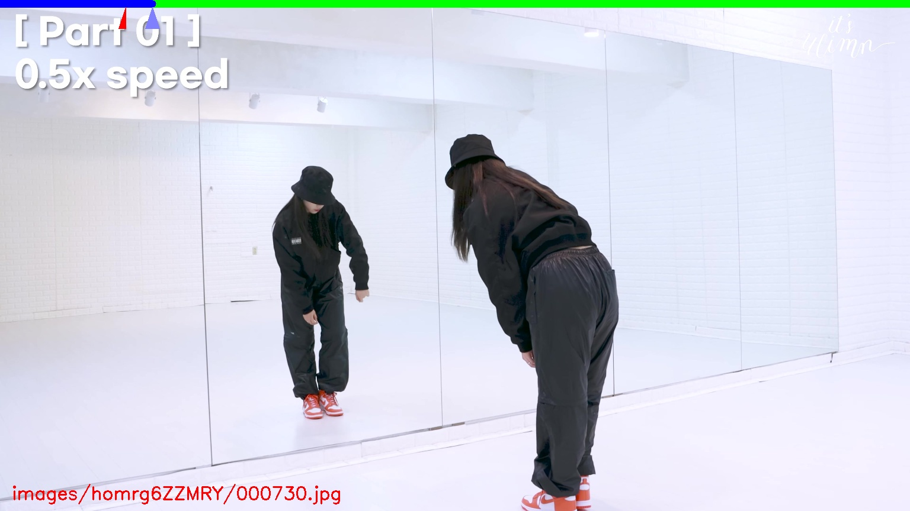
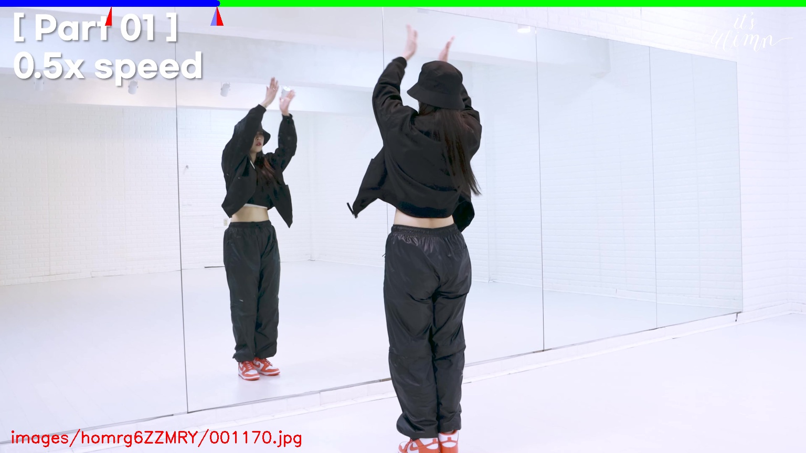
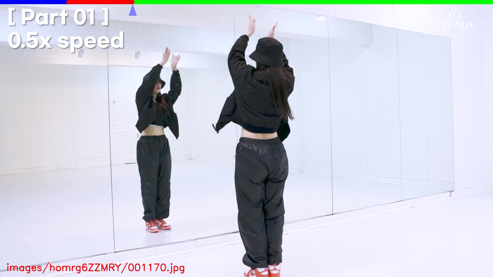
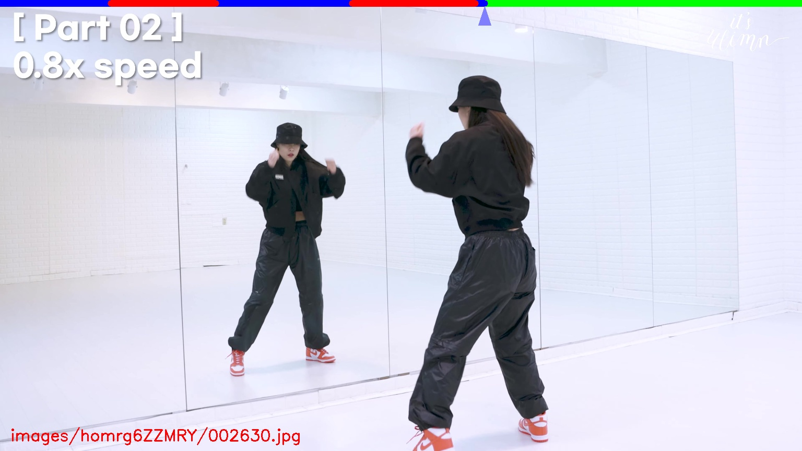

# Prepare Your Mirrored-Human Dataset
{: .no_toc }

1. TOC
{:toc}
---

## Download the videos from Youtube

Find some channels in the YouTube like [ 잇츠유림 It's U Limn ](https://www.youtube.com/channel/UChRjZQ9i7Ci1pfYsEC_syMg). In their homepage, you may find many related videos like [this](https://www.youtube.com/watch?v=homrg6ZZMRY).

Given the youtube link, we will try to download its max resolution:

```bash
# install the pytube
python3 -m pip install pytube
# download the video given the url
database=data/youtube
python3 scripts/dataset/download_youtube.py "https://www.youtube.com/watch?v=homrg6ZZMRY" --database ${database}
```

## Extract the images and mannually clip

First extract the images.

```bash
# extract the videos to images
python3 apps/preprocess/extract_image.py ${database}
```

Mannually clip the images:

```bash
python3 apps/annotation/annot_clip.py ${database}
```

Main operations: `a/d` for previous/next frame, `w/s` for previous/next 100th frame. `j` for recoding the start of the clip; `k` for recording the end of the clip; `l` for add this clip to database. 

|The arrow at the top indicates the current loaction|After press `j`, the red arrow shows the start position|After press `k`, the right red arrow shows the end position|
|----|----|----|
||||
|After press `l`, the clips will be red.|Repeat this operation, you can record multiple clips.|
||||

{ :.note }
- Some tutorial has different speed of the same motion, just use the most slow clip as it can give less motion blur.


After this annotation, copy the clips to `${data}`

```bash
data=/path/to/output
python3 apps/annotation/annot_clip.py ${database} --copy --out ${data}
```

After this step, you can reconstruct the results in one step or step-by-step.

## One step reconstruction

```bash
xxx
```

The rendered results will be saved at `${data}/output-mirror/smplmesh/`.

If some bug occurs, you should run this algorithm step-by-step and check the results of each step.

## Detect and track the human

```bash
python3 apps/preprocess/extract_keypoints.py ${data} --mode yolo-hrnet
python3 apps/preprocess/extract_track.py ${data}
```

Process failure tracking:

**case 1:** tracking failed because wrong clip, you should re-clip this sequence:

```bash
python3 scripts/preprocess/reclip.py ${data} --start 0 --end <right_end_frame> --delete
```

This script will auto create a new folder and copy the images and annotations to the new folder. `--delete` flag will help you to delete the origina folder.


## Fitting SMPL

```bash
python3 apps/demo/mocap.py ${data} --mode mirror --mono
```
