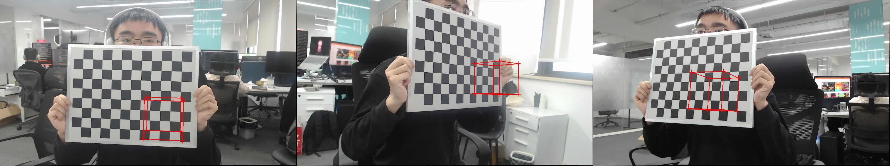

# Realtime Demo
{: .no_toc }

- TOC
{:toc}
---
****
In this tutorial, we show how to build a real-time mocap system with EasyMocap.

## 0. Setup your cameras and calibrate them

In our tutorial, we use 3 usb cameras and place them in left, middle, and right of the desktop.

```bash
python3 apps/camera/realtime_display.py --cfg_cam config/camera/usb-logitech.yml --display
```

There will be three windows display in the screen.

```bash
data=dataset/desktop/calib
# record the videos
python3 apps/camera/realtime_display.py --cfg_cam config/camera/usb-logitech.yml --display --num 1800 --out ${data}
# calibration the camera
python3 apps/calibration/calib_onestep.py ${data} --grid 0.03 --pattern 11,8
```

<div align="center">
    <video width="80%" playsinline="" autoplay="autoplay" loop="loop" preload="" muted=""><source src="../videos/desktop-calib.mp4" type="video/mp4">
    </video>
    <br>
    <sup>Calibration example.</sup>
</div>

{: .note }
- You should keep the chessboard static and visible in all views at the start.
- You should fix the focals of all cameras.

After the calibration, check the camera parameters and visualize.

```bash
python3 apps/calibration/check_calib.py ${data} --mode cube --out ${data} --grid_step 0.1 --write --show
```

<div align="center">
    
    <br>
    <sup>Check the calibration results. The cube will be placed on the origin of the world coordinate.</sup>
</div>

## 1. Check the keypoints detection tool

## 2. Run the demo


